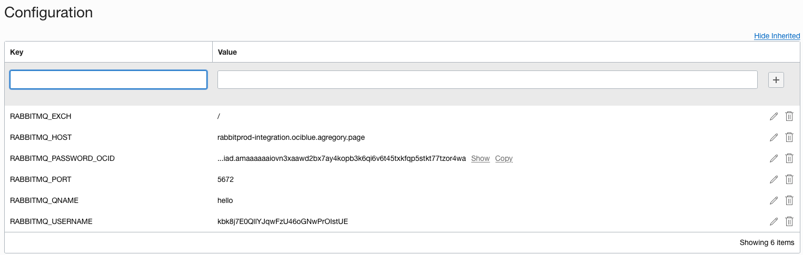
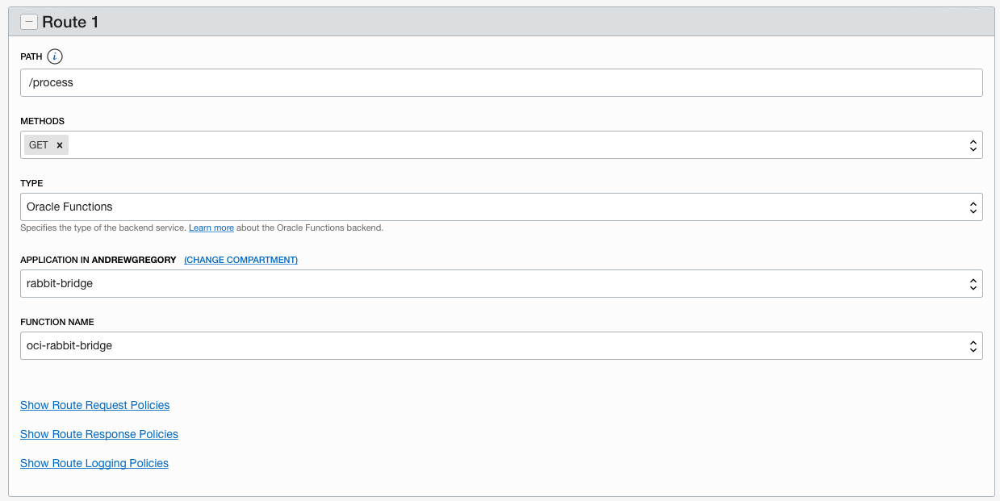

# OCI RabbitMQ Bridge

The purpose of this example is to show that an Oracle Function can consum e messages from an external RabbitMQ environment and provide them to a caller in the form of valid JSON.  The messages are included in a sub-element of the final JSON, but it would be just as simple to return the message from RabbitMQ on its own.  In this case, the Function is exposed via Oracle API Gateway and a public endpoint, protected by OAtuh.  The caller ultimately is an Oracle Integration Cloud environment, where the message contents are required to process be brought in and transformed before going to their final destination.

Rather than running something that constantly needs attention to consume messages from RMQ, the function takes a parameter named "messages", which determines the number of messages to pull from the Queue and return.  

## Overall Architecture

The components are shown here.  Note that WAF is listed, but not required.  As part of any externally facing architecture, it is worth adding as a best practice.


## Installation

This example require the following:

- A working VCN with public and private subnet
- Oracle Functions context set up
- Access via Dynamic Group and Policy for Oracle Functions to consume secrets

The basic process is to install the function into a function app, then connect it to an API Gateway that exists or can be created easily.  The function requires configuration parameters to be set in order to connect ot RabbitMQ, which must be publicly accessible.  NOTE - internally this could be accessible via VPN/FastConnect settings to on-prem or another Oracle VCN.

### Functions Context
The FN command line and OCI command line are install and configured.  The Functions app is created in the compartment and then configured into the context:

```bash
prompt> fn update context registry iad.ocir.io/orasenatdhubsblue02/andrewgregory
Current context updated registry with iad.ocir.io/orasenatdhubsblue02/andrewgregory
prompt> fn update context api-url https://functions.us-ashburn-1.oci.oraclecloud.com
Current context updated api-url with https://functions.us-ashburn-1.oci.oraclecloud.com
prompt> fn update context oracle.compartment-id ocid1.compartment.oc1..aaaaaaaakustitkzuhmihq7lafd33qidihx7pjj7mdb3camxq5eemzetxjpq
Current context updated oracle.compartment-id with ocid1.compartment.oc1..aaaaaaaakustitkzuhmihq7lafd33qidihx7pjj7mdb3camxq5eemzetxjpq

prompt> fn list apps
NAME		ID
helloworld-app	ocid1.fnapp.oc1.iad.aaaaaaaaafygwtna3nstt56z2hub2pp2glb4ua24jhjtkazudo3htg76hbcq
rabbit-bridge	ocid1.fnapp.oc1.iad.aaaaaaaaae4yfxpskji7w4izxpddjkgvbixgj3gdlrx42r3okildnnoibneq
```

### Install the function
The function is deployed to the existing application:
```bash
prompt> fn -v deploy --app rabbit-bridge
Deploying oci-rabbit-bridge to app: rabbit-bridge
Bumped to version 0.0.10
Building image iad.ocir.io/orasenatdhubsblue02/andrewgregory/oci-rabbit-bridge:0.0.10
FN_REGISTRY:  iad.ocir.io/orasenatdhubsblue02/andrewgregory
Current Context:  agfunctions
[+] Building 2.9s (18/18) FINISHED
 => [internal] load build definition from Dockerfile722032111                                                                                                                                                       0.0s
 => => transferring dockerfile: 651B                                                                                                                                                                                0.0s
 => [internal] load .dockerignore                                                                                                                                                                                   0.0s
 => => transferring context: 2B                                                                                                                                                                                     0.0s
 => [internal] load metadata for docker.io/fnproject/python:3.8.5                                                                                                                                                   0.9s
 => [internal] load metadata for docker.io/fnproject/python:3.8.5-dev                                                                                                                                               0.8s
 => [auth] fnproject/python:pull token for registry-1.docker.io                                                                                                                                                     0.0s
 => [build-stage 1/6] FROM docker.io/fnproject/python:3.8.5-dev@sha256:322c3d377c9f5e656d72f7a96fc5c92b64394f3f95cfa27a4ceb20cff63e6636                                                                             0.0s
 => [internal] load build context                                                                                                                                                                                   0.0s
 => => transferring context: 895B                                                                                                                                                                                   0.0s
 => [stage-1 1/5] FROM docker.io/fnproject/python:3.8.5@sha256:29869ba6fa70c6226954e9d54a91b25c60378d5f07ea5197d517e5128be366c8                                                                                     0.0s
 => CACHED [build-stage 2/6] WORKDIR /function                                                                                                                                                                      0.0s
 => CACHED [build-stage 3/6] ADD requirements.txt /function/                                                                                                                                                        0.0s
 => CACHED [build-stage 4/6] RUN pip3 install --target /python/  --no-cache --no-cache-dir -r requirements.txt &&       rm -fr ~/.cache/pip /tmp* requirements.txt func.yaml Dockerfile .venv &&       chmod -R o+  0.0s
 => [build-stage 5/6] ADD . /function/                                                                                                                                                                              0.0s
 => [build-stage 6/6] RUN rm -fr /function/.pip_cache                                                                                                                                                               0.4s
 => CACHED [stage-1 2/5] WORKDIR /function                                                                                                                                                                          0.0s
 => CACHED [stage-1 3/5] COPY --from=build-stage /python /python                                                                                                                                                    0.0s
 => [stage-1 4/5] COPY --from=build-stage /function /function                                                                                                                                                       0.0s
 => [stage-1 5/5] RUN chmod -R o+r /function                                                                                                                                                                        0.3s
 => exporting to image                                                                                                                                                                                              0.0s
 => => exporting layers                                                                                                                                                                                             0.0s
 => => writing image sha256:ae14aac8994b69e0b3ca41bb2a3f1bfab74b30b926cf65fec05187a95cae3789                                                                                                                        0.0s
 => => naming to iad.ocir.io/orasenatdhubsblue02/andrewgregory/oci-rabbit-bridge:0.0.10                                                                                                                             0.0s

Parts:  [iad.ocir.io orasenatdhubsblue02 andrewgregory oci-rabbit-bridge:0.0.10]
Pushing iad.ocir.io/orasenatdhubsblue02/andrewgregory/oci-rabbit-bridge:0.0.10 to docker registry...The push refers to repository [iad.ocir.io/orasenatdhubsblue02/andrewgregory/oci-rabbit-bridge]
98221ac6e92a: Pushed
df366584cef7: Pushed
20ebff8efec9: Layer already exists
e534c6b6c6b2: Layer already exists
99c8d794f17e: Layer already exists
83adc987852c: Layer already exists
bb38c3f3fcc5: Layer already exists
9f72a1f4c21f: Layer already exists
6280b41d048d: Layer already exists
bd8e6688d36c: Layer already exists
07cab4339852: Layer already exists
0.0.10: digest: sha256:b7acf738fca993fc8ac2fddee43e4e08adc9f1503e40a0b3560af5ae8292d557 size: 2625
Updating function oci-rabbit-bridge using image iad.ocir.io/orasenatdhubsblue02/andrewgregory/oci-rabbit-bridge:0.0.10...
```
Once the function has been installed, it can be seen with the FN command
```bash
prompt> fn list functions rabbit-bridge
NAME			IMAGE									ID
oci-rabbit-bridge	iad.ocir.io/orasenatdhubsblue02/andrewgregory/oci-rabbit-bridge:0.0.9	ocid1.fnfunc.oc1.iad.aaaaaaaaadaez3nbmg4wnzonkui4hpa5r5kye6okbbbrhgcrxwurjjt2ddoq

```
### Configure the Function

In order for the function to operate, the following configs must be set.  Note that the RABBITMQ_PASSWORD_OCID is a reference to a an OKE Vault, which must be readable by the function.  In the simplest case, the Vault is located in the same compartment as the rest of the resources, and access is controlled via Dynamic Group and Access Policy. 



### Invoke the function
Invoking the function from the command line requires a JSON message to be sent in, containing the "messages" element, a count of messages to pop from the RabbitMQ Queue.  Here is an example of calling the function with an empty Q, then populating it with messages using the utility, finally pulling multiple messages.
```bash
prompt> echo '{"messages":10}'|fn invoke rabbit-bridge oci-rabbit-bridge |python -m json.tool
{
    "Messages": [],
    "OriginalRequest": {
        "messages": 10
    },
    "ReturnCodes": "0-Begin0-MessagesToRead:10|1-RMQConnect rabbitprod-integration.ociblue.agregory.page 5672|5-MessageCount 0"
}

prompt> ./utilities/rabbitpublish.py
Startup
<BlockingConnection impl=<SelectConnection OPEN transport=<pika.adapters.utils.io_services_utils._AsyncPlaintextTransport object at 0x1065b56d0> params=<ConnectionParameters host=rabbitprod-integration.ociblue.agregory.page port=5672 virtual_host=/ ssl=False>>>
Connected to RabbitMQ Channel <BlockingChannel impl=<Channel number=1 OPEN conn=<SelectConnection OPEN transport=<pika.adapters.utils.io_services_utils._AsyncPlaintextTransport object at 0x1065b56d0> params=<ConnectionParameters host=rabbitprod-integration.ociblue.agregory.page port=5672 virtual_host=/ ssl=False>>>>
 [x] Sent {"text": "rabbit message 2021-02-19 07:42:03.769061"}

prompt> ./utilities/rabbitpublish.py
Startup
<BlockingConnection impl=<SelectConnection OPEN transport=<pika.adapters.utils.io_services_utils._AsyncPlaintextTransport object at 0x1108da6d0> params=<ConnectionParameters host=rabbitprod-integration.ociblue.agregory.page port=5672 virtual_host=/ ssl=False>>>
Connected to RabbitMQ Channel <BlockingChannel impl=<Channel number=1 OPEN conn=<SelectConnection OPEN transport=<pika.adapters.utils.io_services_utils._AsyncPlaintextTransport object at 0x1108da6d0> params=<ConnectionParameters host=rabbitprod-integration.ociblue.agregory.page port=5672 virtual_host=/ ssl=False>>>>
 [x] Sent {"text": "rabbit message 2021-02-19 07:42:05.759160"}

prompt> echo '{"messages":10}'|fn invoke rabbit-bridge oci-rabbit-bridge |python -m json.tool
{
    "Messages": [
        {
            "text": "rabbit message 2021-02-19 07:42:03.769061"
        },
        {
            "text": "rabbit message 2021-02-19 07:42:05.759160"
        }
    ],
    "OriginalRequest": {
        "messages": 10
    },
    "ReturnCodes": "0-Begin0-MessagesToRead:10|1-RMQConnect rabbitprod-integration.ociblue.agregory.page 5672|4-MessageRead db3ecdce-0c7b-429d-b6a3-17500bc27867|4-MessageRead 554f71cf-8127-41a5-93bb-d9d621144630|5-MessageCount 2"
}
````
### Add API Gateway 
Once the function is running, add the API Gateway or use an existing deployment.  This must also be configured per docs to allow access to Oracle Functions.  Once completed, add a deployment and then route as follows:


The GW can be accessed via CURL before configuring for AuthN/AuthZ (out of scope). Following are exampels with and without messages.
```bash
# No Messages to pull
prompt> curl -k -X GET https://oxd3evz4z3r2vxvargpmwvc57e.apigateway.us-ashburn-1.oci.customer-oci.com/bridgev1/process -d '{"messages":3}'
{'ReturnCodes': '0-Begin0-MessagesToRead:3|1-RMQConnect rabbitprod-integration.ociblue.agregory.page 5672|5-MessageCount 0', 'OriginalRequest': {'messages': 3}}%

# Add a message to Q
prompt> ./utilities/rabbitpublish.py
Startup
<BlockingConnection impl=<SelectConnection OPEN transport=<pika.adapters.utils.io_services_utils._AsyncPlaintextTransport object at 0x103097e20> params=<ConnectionParameters host=rabbitprod-integration.ociblue.agregory.page port=5672 virtual_host=/ ssl=False>>>
Connected to RabbitMQ Channel <BlockingChannel impl=<Channel number=1 OPEN conn=<SelectConnection OPEN transport=<pika.adapters.utils.io_services_utils._AsyncPlaintextTransport object at 0x103097e20> params=<ConnectionParameters host=rabbitprod-integration.ociblue.agregory.page port=5672 virtual_host=/ ssl=False>>>>
 [x] Sent {"text":"rabbit message"}

# Message to pull
prompt> curl -X GET https://oxd3evz4z3r2vxvargpmwvc57e.apigateway.us-ashburn-1.oci.customer-oci.com/rabbitbridge/invoke -d '{"messages":1}'
{"Messages": [{"text": "rabbit message 2021-02-19 08:15:46.990803"}], "ReturnCodes": "0-Begin0-MessagesToRead:1|1-RMQConnect rabbitprod-integration.ociblue.agregory.page 5672|4-MessageRead 8410ea36-5304-4b1c-bfeb-8f45e6b83278|5-MessageCount 1", "OriginalRequest": {"messages": 1}}

```

## Utilities

Included are simple python scripts to publish a test message and to consume messages from Rabbit MQ.  To use them, export the password and edit the parameters in the script:

```bash

prompt> export RABBITMQ_PASSWORD=xxxxx
prompt> ./rabbitpublish.py
Startup
<BlockingConnection impl=<SelectConnection OPEN transport=<pika.adapters.utils.io_services_utils._AsyncPlaintextTransport object at 0x106b13e20> params=<ConnectionParameters host=rabbitprod-integration.ociblue.agregory.page port=5672 virtual_host=/ ssl=False>>>
Connected to RabbitMQ Channel <BlockingChannel impl=<Channel number=1 OPEN conn=<SelectConnection OPEN transport=<pika.adapters.utils.io_services_utils._AsyncPlaintextTransport object at 0x106b13e20> params=<ConnectionParameters host=rabbitprod-integration.ociblue.agregory.page port=5672 virtual_host=/ ssl=False>>>>
 [x] Sent {"text":"rabbit message"}

prompt> ./rabbitconsume.py
Startup
<BlockingConnection impl=<SelectConnection OPEN transport=<pika.adapters.utils.io_services_utils._AsyncPlaintextTransport object at 0x107c48850> params=<ConnectionParameters host=rabbitprod-integration.ociblue.agregory.page port=5672 virtual_host=/ ssl=False>>>
Connected to RabbitMQ Channel <BlockingChannel impl=<Channel number=1 OPEN conn=<SelectConnection OPEN transport=<pika.adapters.utils.io_services_utils._AsyncPlaintextTransport object at 0x107c48850> params=<ConnectionParameters host=rabbitprod-integration.ociblue.agregory.page port=5672 virtual_host=/ ssl=False>>>>
<Basic.GetOk(['delivery_tag=1', 'exchange=', 'message_count=0', 'redelivered=False', 'routing_key=hello'])> <BasicProperties(['content_type=application/json', 'message_id=1de0d00f-942f-45b5-a026-c9e20771a155'])> b'{"text":"rabbit message"}'
b'{"text":"rabbit message"}'
No message returned
Done Reading {'1de0d00f-942f-45b5-a026-c9e20771a155': b'{"text":"rabbit message"}', 'codes': '{"ret":"retv"}'} message

```
